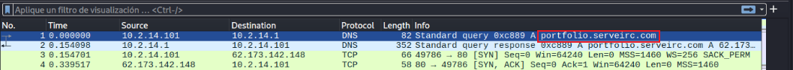
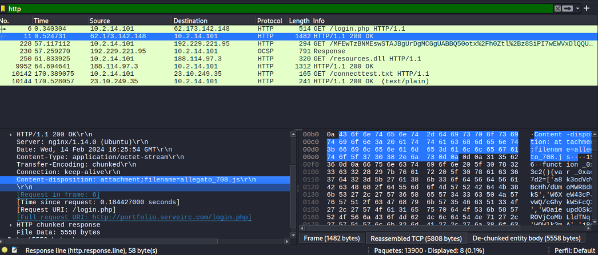
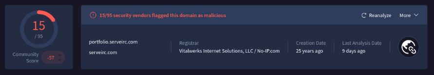
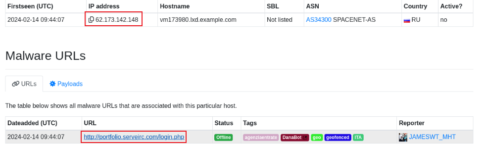
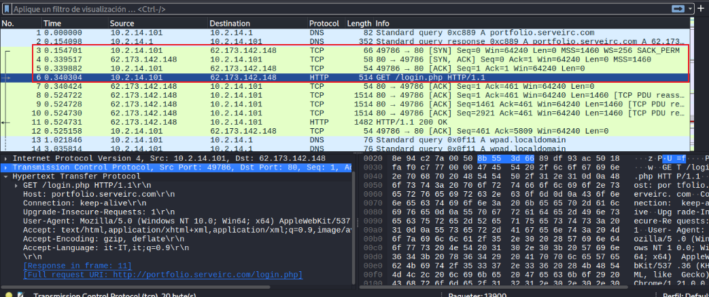
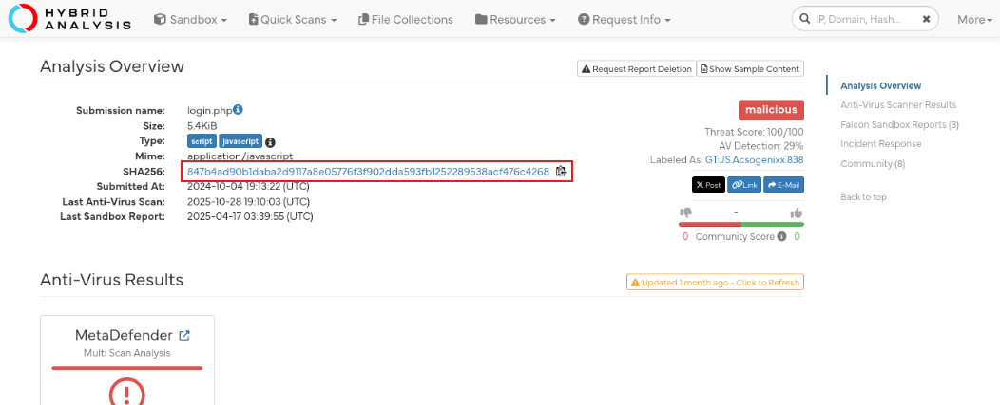
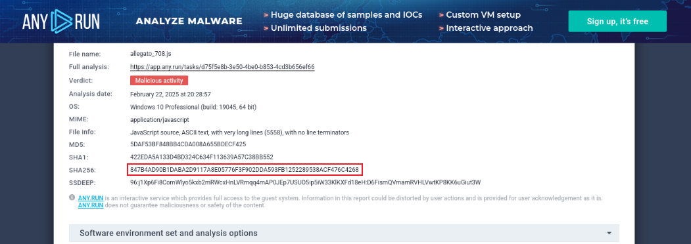
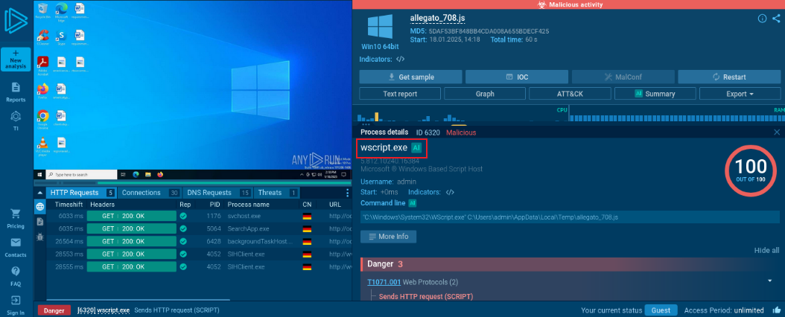
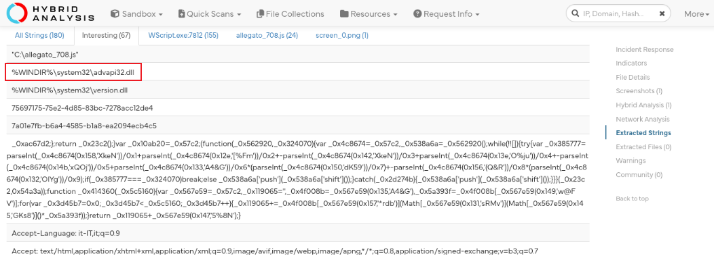
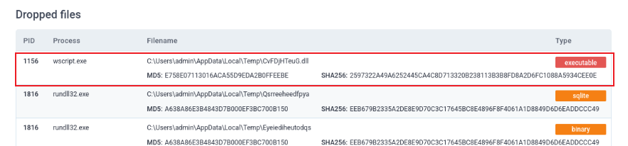

# Analiza y triunfarás

## **Introducción**

Antes que nada, quiero comentar algo: aunque este laboratorio es relativamente sencillo, requiere bastante paciencia y perseverancia. Si quieren obtener los resultados correctos, es clave prestar atención a los detalles: las fechas de los análisis, los nombres de los archivos y cualquier pista pequeña que pueda parecer insignificante.

## **Observaciones iniciales**

Lo primero que me llamó la atención, apenas abrí la captura en Wireshark, fue esto:

Como analistas, una de las primeras cosas que debemos tener siempre presente es:

- Quién se está conectando a nuestra red y desde dónde lo está haciendo.

## **Detección de indicadores maliciosos**

Al seguir revisando, noté lo siguiente:

- En VirusTotal, el dominio aparecía relacionado con actividad maliciosa.

También consulté el dominio en URLhaus, donde aparecía reportado en varios registros recientes, lo que reforzaba la correlación con campañas de distribución de malware.

## **Análisis del tráfico capturado**

Con estos indicios sobre la mesa, era momento de ponernos en marcha y empezar a reconstruir paso a paso lo que realmente había ocurrido en la captura.
Al revisar el inicio de la captura, se puede observar claramente el three-way handshake previo a la conexión TCP donde ocurre el acceso inicial. También la dirección IP asociada al atacante y el dominio previamente identificado en VirusTotal y URLhaus.

Si prestamos suficiente atención a los primeros paquetes posteriores a la conexión, notamos que se produce una transferencia de datos acompañada por un código de estado HTTP 200 OK. Siguiendo ese hilo, es posible identificar con claridad el archivo que se está intercambiando durante la sesión.

Y acá es donde entran en juego el tema de los hashes y todo ese análisis adicional. Normalmente estoy acostumbrado a descargar el archivo directamente y calcular su hash con alguna herramienta en Linux, pero en este caso eso no es posible: el dominio ya no funciona. Por lo tanto, toca investigar análisis previos, reportes ya publicados o cualquier referencia que aparezca relacionada con el nombre del archivo para avanzar con la identificación.

## **Investigación del archivo y comportamiento**

En mi búsqueda, encontré que en ANY.RUN había información relacionada con el archivo, y para corroborarlo lo verifiqué también en Hybrid-Analysis, donde los resultados coincidían y reforzaban la identificación del malware.

Además, en ANY.RUN podemos acceder a un análisis más avanzado, lo que nos permite ver con detalle los procesos ejecutados por el malware durante su ejecución y cómo interactúa con el sistema.

Aun así, Hybrid-Analysis nos confirma otros datos esenciales para el laboratorio, como la extencion del segundo archivo malicioso que el atacante utilizó durante el contacto inicial.

Mientras revisaba el reporte completo, en la sección Dropped Files aparecen justamente los elementos que necesitábamos para responder las últimas preguntas del laboratorio. Ahí es donde se listan los archivos que el malware genera o descarga durante la ejecución, junto con sus extensiones, nombres y hashes, lo cual permite completar esa parte sin necesidad de tener acceso a la muestra original.

## **Conclusión**

En resumen, este laboratorio demuestra que incluso cuando no podemos obtener directamente una muestra maliciosa, es posible reconstruir el incidente apoyándonos en fuentes externas, reportes previos y una revisión detallada del tráfico capturado. Cruzar información entre distintos servicios nos permite validar hallazgos, descartar falsos positivos y entender mejor el comportamiento del malware involucrado.
Como siempre, la clave está en no pasar por alto nada: cada paquete, cada dominio y cada coincidencia cuentan para armar el rompecabezas completo.
